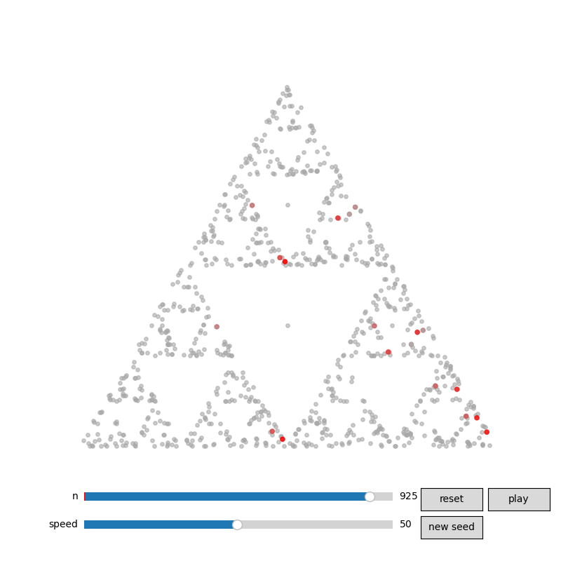

# Chaos Game: Sierpinski Gasket

A Python visualization of the chaos game that generates the Sierpinski Gasket (otherwise known as the Sierpinski Triangle).

---

## Output

An interactive viewing window with a slider to add points by hand, along with a play button and speed gauge to add points automatically. The 20 newest points are rendered in red and cool down to grey as new points are added.

<div align="center">
  
</div>

---

## Mathematical Background

The Sierpinski Gasket is a fractal in the plane. One classical construction begins with an equilateral triangle, removes the middle triangle to leave a triforce shape, and iterates removing the middle triangle from each remaining piece. In the limit, the resulting shape is the Sierpinski Gasket.

A more surprising construction is the **chaos game**. The Sierpinski Gasket is the attractor of an *iterated function system* (IFS) consisting of three contraction maps, one for each vertex $v_1, v_2, v_3$ of the triangle:

$$f_i(x) = \frac{x + v_i}{2}, \quad i = 1, 2, 3$$

Each map contracts the plane by a factor of $\frac{1}{2}$ toward vertex $v_i$. By the Banach fixed point theorem, lifting this IFS to the space of compact subsets under the Hausdorff metric guarantees a unique compact attractor: the Sierpinski Gasket.

The chaos game samples this attractor: starting from any point, repeatedly apply a randomly chosen $f_i$. After a brief transient, every point in the orbit lies on the attractor. This visualization uses the vertices of the unit equilateral triangle:

$$v_1 = (0, 1), \quad v_2 = \left(\cos\frac{7\pi}{6}, \sin\frac{7\pi}{6}\right), \quad v_3 = \left(\cos\frac{11\pi}{6}, \sin\frac{11\pi}{6}\right)$$

---

## Project Structure

```
sierpinski-chaos/
├── README.md          # This file
├── requirements.txt   # Python dependencies
├── .gitignore         # Files excluded from version control
├── chaos.py           # Chaos game implementation
└── plot.py            # Interactive visualization
```

---

## Setup

**Requirements:** Python 3.9+

1. Clone the repository:
```bash
   git clone https://github.com/alex-o7/sierpinski-chaos.git
   cd sierpinski-chaos
```

2. Create and activate a virtual environment:
```bash
   python3 -m venv venv
   source venv/bin/activate        # macOS/Linux
   venv\Scripts\activate           # Windows
```

3. Install dependencies:
```bash
   pip install -r requirements.txt
```

---

## Usage

```bash
python3 plot.py
```

This opens an interactive window. Use the **n slider** to add points manually, **play** to animate, and **speed** to control the animation rate. Click **new seed** to generate a fresh random orbit, or **reset** to return to the beginning of the current one.

---

## Dependencies

- `numpy` — point generation and array operations
- `matplotlib` — interactive visualization